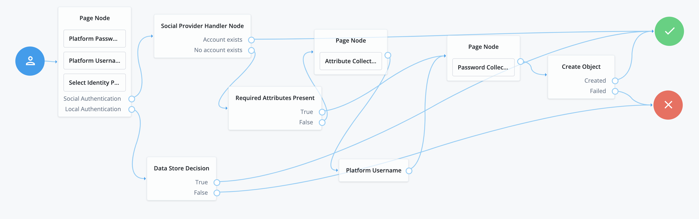
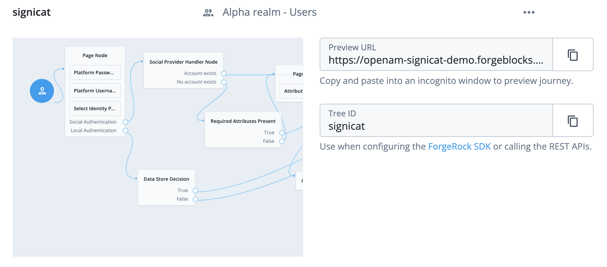

# Signicat Documentation
## Introduction
Signicat is the leading provider of digital identity solutions in Europe. This integration enables identity verification and authentication across the Nordic and Benelux regions through 9 ForgeRock supported Signicat IdPs. For additional information on how digital identity can grow a business visit: https://www.signicat.com/blog/what-is-a-digital-identity
## Normalization Scripts
This section provides steps for how to set up the Social Identity Provider Profile Transformation scripts required for this integration.
 
1.) Under the  “Native Consoles” tab open “Access Management”  
2.) Select the Realm > Scripts > +New Script  
3.) Name the Script(i.e “Signicat Profile Normalization”) > Script Type > Social Identity Profile Transformation  
4.) Set language to “Groovy”  
5.) Paste the following code snippet into the Script field:   
                  
      import static org.forgerock.json.JsonValue.field
      import static org.forgerock.json.JsonValue.json
      import static org.forgerock.json.JsonValue.object

      return json(object(
      field("id", rawProfile.sub),
      field("displayName", rawProfile.name),
      field("givenName", rawProfile.given_name),
      field("familyName", rawProfile.family_name ),
      field("fr-attr-str1", rawProfile.signicat.national_id),
      field("email", rawProfile.email),
      field("username", rawProfile.email)))

6.) Go into scripts again, and find the "Normalized Profile to Managed User" script. This script will convert the normalized social profile into a managed user. Delete the contents of the script and copy & paste the following code snippet into the Script field: 

      import static org.forgerock.json.JsonValue.field
      import static org.forgerock.json.JsonValue.json
      import static org.forgerock.json.JsonValue.object

      import org.forgerock.json.JsonValue

      JsonValue managedUser = json(object())

      if (normalizedProfile.username.isNotNull()) managedUser.put("userName", normalizedProfile.username)
      if (normalizedProfile.familyName.isNotNull()) managedUser.put("sn", normalizedProfile.familyName)
      if (normalizedProfile.givenName.isNotNull()) managedUser.put("givenName", normalizedProfile.givenName)
      if (normalizedProfile.email.isNotNull()) managedUser.put("mail", normalizedProfile.email)
      if (normalizedProfile.postalAddress.isNotNull()) managedUser.put("postalAddress", normalizedProfile.postalAddress)
      if (normalizedProfile.addressLocality.isNotNull()) managedUser.put("city", normalizedProfile.addressLocality)
      if (normalizedProfile.addressRegion.isNotNull()) managedUser.put("stateProvince", normalizedProfile.addressRegion)
      if (normalizedProfile.postalCode.isNotNull()) managedUser.put("postalCode", normalizedProfile.postalCode)
      if (normalizedProfile.country.isNotNull()) managedUser.put("country", normalizedProfile.country)
      if (normalizedProfile.phone.isNotNull()) managedUser.put("telephoneNumber", normalizedProfile.phone)

      return managedUser
   

## Configure IdPs
This section provides steps on how to configure each indiviual IdP that Signicat currently offers supported by ForgeRock using the AM console. 
 
In the "Native Console" select "Access Management" from the drop down. Select the Realm and go to Services > Social Identity Provider Service > Secondary Configurations > Add a Secondary Configuration > Select “Client configuration for providers that implement Open ID Connect specifications” Fill out the fields within “New oidcConfig configuration” according to the following. If not indicated, leave the field blank. 
 
 
Note: The URLS provided in this documentation are production URLS for customer usage. 
                             
### 1.) Norwegian BankID | Market Coverage: Norway
- **Overview:**  Norwegian BankID (as well as Norwegian BankID on Mobile) is an electronic identity scheme in Norway that can be used for digital onboarding (Assure), authentication (Connect) and electronic signing (Sign) of documents. BankID is based on a coordinated infrastructure that is developed by the banks through the Norwegian BankID Cooperation, under the direction of the “Finansnæringens Hovedorganisasjon” and “Sparebankforeningen”. Signicat is the leading provider of Norwegian BankID in Norway with over 75% of the total BankID traffic. Signicat is delivering BankID to banks, consumer finance firms, insurance companies, government services as well as small and medium business segments.

- **Fill out the following fields:** 
Auth ID Key: `sub`  
Client ID: `TBD(Provided by Signicat)`  
Authentication Endpoint URL: `https://eu01.signicat.com/oidc/authorize`  
Access Token Endpoint URL: `https://eu01.signicat.com/oidc/token`  
User Profile Service URL: `https://eu01.signicat.com/oidc/userinfo`  
Redirect URL: `TBD(Provided by Signicat)`  
Scope Delimiter: Put a single space (“ “)  
OAuth Scopes: `openid`, `profile`, `signicat.national_id` make sure that these items are not space nor comma separated, but added as separate items.  
ACR Values: `urn:signicat:oidc:method:nbid`  
Well Known Endpoint: `https://eu01.signicat.com/oidc/.well-known/openid-configuration`  
Issuer: `https://eu01.signicat.com/oidc`   
JWKS URI Endpoint: `https://eu01.signicat.com/oidc/jwks.json`  

- **UI Config Properties:**   Create the following keys and corresponding values: 
buttonImage: `https://cdn.connectis.io/eids-logos/Norwegian-Bank-ID.jpg`  
buttonDisplayName: `NorwegianBankID`  
buttonCustomStyleHolder: `color: #6d6d6d; background-color: #eee;  border-color: #ccc;`  
Transform Script: From the drop down menu, select the `Signicat Profile Normalization` script created in Step 1  
Click “Create”   

- **Once configuration is created, additional fields will be added. Fill out the following:**  
Client Secret: `TBD(Provided by Signicat)`  
Client Authentication Method: `CLIENT_SECRET_BASIC`  
PKCE Method: `S256`  
Enable Native Nonce: Enabled  
User Info Response Format: `JSON`  

### 2.) Norwegian BankID Mobile | Market Coverage: Norway
- **Overview:**  Norwegian BankID on Mobile (BankID på Mobil) is an electronic identity scheme in Norway that can be used for authentication and electronic signing of documents. BankID is based on a coordinated infrastructure developed by the banks through the Norwegian BankID Cooperation, under the direction of the Finansnæringens Hovedorganisasjon and Sparebankforeningen. With Norwegian BankID on Mobile, the user’s certificate is stored on the SIM card of the user’s phone, with a limit of one BankID certificate per SIM card. The user must have a subscription with an operator that supports Norwegian BankID on Mobile.

- **Fill out the following fields:** 
Auth ID Key: `sub`   
Client ID: `TBD(Provided by Signicat)`  
Authentication Endpoint `URL:https://eu01.signicat.com/oidc/authorize`   
Access Token Endpoint `URL: https://eu01.signicat.com/oidc/token`   
User Profile Service `URL: https://eu01.signicat.com/oidc/userinfo`   
Redirect URL: `TBD(Provided by Signicat)`  
Scope Delimiter: Put a single space (“ “)  
OAuth Scopes: `openid`, `profile`, `signicat.national_id` make sure that these items are not space or comma separated, but added as separate items.   
ACR Values: `urn:signicat:oidc:method:nbid-mobil`  
Well Known Endpoint: `https://eu01.signicat.com/oidc/.well-known/openid-configuration`  
Issuer: `https://eu01.signicat.com/oidc`   
JWKS URI Endpoint: `https://eu01.signicat.com/oidc/jwks.json`   
- **UI Config Properties:**  
Create following keys and corresponding values:  
buttonImage > `https://cdn.connectis.io/eids-logos/Norwegian-Bank-ID.jpg`  
buttonDisplayName > `Norwegian BankID Mobile`  
buttonCustomStyleHolder > `color: #6d6d6d; background-color: #eee;  border-color: #ccc;`  
Transform Script: From the drop down menu, select the `Signicat Profile Normalization` script created in Step 1   
Click “Create”   

- **Once configuration is created, additional fields will be added. Fill out the following:**   
Client Secret: `TBD(Provided by Signicat)` 
Client Authentication Method: `CLIENT_SECRET_BASIC`  
PKCE Method: `S256`  
Enable Native Nonce: Enabled  
User Info Response Format: `JSON`  

### 3.) iDIN | Market Coverage: The Netherlands 
- **Overview:** iDIN is a Dutch eID scheme controlled by the Dutch Payment Association. It is a collaboration between all major Dutch banks to facilite electronic identity services which uses familiar secure authentication processes of the online banking environments. Everyone that has a personal bank account at one of the issuing banks can use iDIN, without the need of any additional registration.   
iDIN enables natural persons who have been checked against the requirements of the Money Laundering and Terrorist Financing (Prevention) Act (Wwft) to provide one or several attributes directly from the bank records to Signicat merchants, through a secure channel specifically designed for this purpose. Merchants can use iDIN to onboard new users and authenticate recurring users without the need for new passwords. iDIN can also be used to sign legally binding documents.

- **Fill out the following fields:** 
Auth ID Key: `sub`  
Client ID: TBD(Provided by Signicat) 
Authentication Endpoint URL: `https://eu01.signicat.com/oidc/authorize`  
Access Token Endpoint URL: `https://eu01.signicat.com/oidc/token`   
User Profile Service URL: `https://eu01.signicat.com/oidc/userinfo`   
Redirect URL: TBD(Provided by Signicat)  
Scope Delimiter: Put a single space (“ “)   
OAuth Scopes: `openid`, `profile`, `signicat.idin`, `signicat.national_id` make sure that these items are not space or comma separated, but added as separate items.   
ACR Values: `urn:signicat:oidc:method:idin-ident`  
Well Known Endpoint: `https://eu01.signicat.com/oidc/.well-known/openid-configuration`  
Issuer: `https://eu01.signicat.com/oidc`   
JWKS URI Endpoint: `https://eu01.signicat.com/oidc/jwks.json`   
UI Config Properties:  
- **Create following keys and corresponding values:**  
buttonImage >  `https://cdn.connectis.io/eids-logos/iDIN.png`  
buttonDisplayName > `iDIN`  
buttonCustomStyleHolder > `color: #6d6d6d; background-color: #eee; border-color: #ccc;`  
Transform Script: From the drop down menu, select the `Signicat Profile Normalization` script created in Step 1   
Click “Create”   

- **Once configuration is created, additional fields will be added. Fill out the following:**   
Client Secret: TBD(Provided by Signicat)   
Client Authentication Method: `CLIENT_SECRET_BASIC`  
PKCE Method: `S256`  
Enable Native Nonce: Enabled  
User Info Response Format: `JSON`  

### 4.) Swedish BankID | Market Coverage: Sweden 
- **Overview:** Swedish BankID is an electronic identity scheme in Sweden that can be used for identity proofing during onboarding of new customers, authentication of existing customers and electronic signing.
Individuals who have a Swedish national identification number (personnummer) can obtain Swedish BankID through their bank. BankID may be issued to persons over 18 years, but several banks also give BankID to persons under 18 years.

- **Fill out the following fields:** 
Auth ID Key: `sub`  
Client ID: TBD(Provided by Signicat)  
Authentication Endpoint URL: `https://eu01.signicat.com/oidc/authorize`   
Access Token Endpoint URL:`https://eu01.signicat.com/oidc/token`   
User Profile Service URL: `https://eu01.signicat.com/oidc/userinfo`   
Redirect URL: TBD(Provided by Signicat)  
Scope Delimiter: Put a single space (“ “)  
OAuth Scopes:`openid`, `profile`, `signicat.national_id` make sure that these items are not space or comma separated, but added as separate items.   
ACR Values:`urn:signicat:oidc:method:sbid`  
Well Known Endpoint: `https://eu01.signicat.com/oidc/.well-known/openid-configuration`  
Issuer: `https://eu01.signicat.com/oidc`   
JWKS URI Endpoint: `https://eu01.signicat.com/oidc/jwks.json`   
- **UI Config Properties:**  
Create following keys and corresponding values:  
buttonImage > `https://cdn.connectis.io/eids-logos/swedish-bank-id.png`  
buttonDisplayName > `Swedish BankID`  
buttonCustomStyleHolder > `color: #6d6d6d; background-color: #eee;  border-color: #ccc;`  
Transform Script: From the drop down menu, select the `Signicat Profile Normalization` script created in Step 1  
Click “Create”   

- **Once configuration is created, additional fields will be added. Fill out the following:**   
Client Secret: TBD(Provided by Signicat)  
Client Authentication Method: `CLIENT_SECRET_BASIC`  
PKCE Method: `S256`  
Enable Native Nonce: `Enabled`   
User Info Response Format: `JSON`  
	
### 5.) MitID | Market Coverage: Denmark
- **Overview:** MitID is a collaboration between the Danish banks and the Danish public sector. This alliance forms a nationwide solution and provides a secure authentication mechanism for all Danish citizens and residents. MitID can be used for online banking, Digital Post, communication with public authorities, identifying yourself in other digital services and more.

- **Fill out the following fields:** 
Auth ID Key: `sub`  
Client ID: TBD(Provided by Signicat)  
Authentication Endpoint URL:`https://id.signicat.com/oidc/authorize`   
Access Token Endpoint URL:`https://id.signicat.com/oidc/token`   
User Profile Service URL:`https://id.signicat.com/oidc/userinfo`  
Redirect URL: TBD(Provided by Signicat) 
Scope Delimiter: Put a single space (“ “)  
OAuth Scopes:`openid`, `profile`, `mitid`, `signicat.national_id` make sure that these items are not space or comma separated, but added as separate items.   
ACR Values: `urn:signicat:oidc:method:mitid-cpr`  
Well Known Endpoint: `https://id.signicat.com/oidc/.well-known/openid-configuration`  
Issuer: `https://id.signicat.com/oidc`   
JWKS URI Endpoint:`https://id.signicat.com/oidc/jwks.json`   
- **UI Config Properties:**  
      Create following keys and corresponding values:
            buttonImage > `https://cdn.connectis.io/eids-logos/mitid.jpg`  
            buttonDisplayName > `MitID`  
buttonCustomStyleHolder > `color: #6d6d6d; background-color: #eee;  border-color: #ccc;`  
Transform Script: From the drop down menu, select the `Signicat Profile Normalization` script created in Step 1   
Click “Create”   

- **Once configuration is created, additional fields will be added. Fill out the following:**   
Client Secret: TBD(Provided by Signicat)  
Client Authentication Method: `CLIENT_SECRET_BASIC`   
PKCE Method: `S256`   
Enable Native Nonce: `Enabled`   
User Info Response Format: `JSON`   

### 6.) NemID | Market Coverage: Denmark
- **Overview:** NemID is a collaboration between the Danish banks and the Danish public sector. This alliance forms a countrywide solution and provides a secure login mechanism for websites wanting to use the free-of-charge digital ID for all citizens in Denmark. As of January 2020, a total of five million Danish citizens have ordered a NemID. NemID is run by Nets DanID.  **Note:** NemID is to be phased out by the end of 2022, and replaced with MitID (the eID in the previous row). In the transition phase, customers might want to offer their users both methods until NemID is finally decommissioned.

- **Fill out the following fields:** 
Auth ID Key: `sub`  
Client ID: TBD(Provided by Signicat) 
Authentication Endpoint URL:`https://id.signicat.com/oidc/authorize`   
Access Token Endpoint URL:`https://id.signicat.com/oidc/token`   
User Profile Service URL: `https://id.signicat.com/oidc/userinfo`  
Redirect URL: TBD(Provided by Signicat)  
Scope Delimiter: Put a single space (“ “)  
OAuth Scopes:`openid`, `profile`, `signicat.national_id` make sure that these items are not space or comma separated, but added as separate items.   
ACR Values:`urn:signicat:oidc:method:nemid`  
Well Known Endpoint: `https://id.signicat.com/oidc/.well-known/openid-configuration`  
Issuer:`https://id.signicat.com/oidc`   
JWKS URI Endpoint:`https://id.signicat.com/oidc/jwks.json`   
- **UI Config Properties:**  
Create following keys and corresponding values:  
buttonImage > `https://cdn.connectis.io/eids-logos/nemid.jpg`  
buttonDisplayName > `NemID`  
buttonCustomStyleHolder > `color: #6d6d6d; background-color: #eee;  border-color: #ccc;`  
Transform Script: From the drop down menu, select the `Signicat Profile Normalization` script created in Step 1  
Click “Create”   

- **Once configuration is created, additional fields will be added. Fill out the following:**   
Client Secret: TBD(Provided by Signicat)  
Client Authentication Method: `CLIENT_SECRET_BASIC`  
PKCE Method: `S256`  
Enable Native Nonce: `Enabled`  
User Info Response Format: `JSON`  

### 7.) itsme | Market Coverage: Belgium, The Netherlands

- **Overview:** Belgian Mobile ID (BMID), also referred to as 'itsme', is an identity scheme originating from Belgium. The scheme is co-created by banks and telecom providers to allow easy digital identity proofing and signing use cases. Currently itsme has millions of users in the Belgium market, which is still increasing significantly. itsme provides a mobile application to citizens requiring users to perform a one-time registration before users can start using the service. Users can either onboard in the itsme application either through a bank account or derive the identity directly from the Belgian National Identity Card (Belgium eID).
itsme offers a secure and easy means of electronic identification that allows end-users to digitally log in to and/or register for business and government services and sign documents.

- **Fill out the following fields:** 
Auth ID Key: `sub`  
Client ID: TBD(Provided by Signicat)  
Authentication Endpoint URL: `https://eu01.signicat.com/oidc/authorize`   
Access Token Endpoint URL: `https://eu01.signicat.com/oidc/token`   
User Profile Service URL: `https://eu01.signicat.com/oidc/userinfo`   
Redirect URL: TBD(Provided by Signicat)  
Scope Delimiter: Put a single space (“ “)  
OAuth Scopes:`openid`, `profile`, `signicat.itsme`, `signicat.national_id`, `address` make sure that these items are not space or comma separated, but added as separate items.   
ACR Values:`urn:signicat:oidc:method:itsme-register`  
Well Known Endpoint: `https://eu01.signicat.com/oidc/.well-known/openid-configuration`  
Issuer: `https://eu01.signicat.com/oidc`   
JWKS URI Endpoint: `https://eu01.signicat.com/oidc/jwks.json`   
- **UI Config Properties:**  
Create following keys and corresponding values:  
buttonImage > `https://cdn.connectis.io/eids-logos/Itsme.jpg`  
buttonDisplayName > `itsme`  
buttonCustomStyleHolder > color: `#6d6d6d; background-color: #eee;  border-color: #ccc;`  
Transform Script: From the drop down menu, select the `Signicat Profile Normalization` script created in Step 1  
Click “Create”   

- **Once configuration is created, additional fields will be added. Fill out the following:**   
Client Secret: TBD(Provided by Signicat)  
Client Authentication Method: `CLIENT_SECRET_BASIC`  
PKCE Method: `S256`  
Enable Native Nonce: `Enabled`  
User Info Response Format: `JSON`  
	
### 8.) eHerkenning | Market Coverage: The Netherlands

- **Overview:**  Service providers in the Netherlands can use eHerkenning to allow users to log in on behalf of their organisations. Service providers in the Netherlands can allow users of (non-Dutch) European eIDs to log into their services by using the eHerkenning network. 

- **Fill out the following fields:** 
Auth ID Key: `sub`  
Client ID: TBD(Provided by Signicat)  
Authentication Endpoint URL: TBD(To be inserted per customer once PKIo certificate has been delivered)  
Access Token Endpoint URL:TBD(To be inserted per customer once PKIo certificate has been delivered)  
User Profile Service URL: TBD(To be inserted per customer once PKIo certificate has been delivered) 
Redirect URL: TBD(Provided by Signicat) 
Scope Delimiter: Put a single space (“ “)  
OAuth Scopes:`idp_scoping:simulator` make sure that these items are not space or comma separated, but added as separate items.  
ACR Values:N/A (scope controlled)  
Well Known Endpoint: TBD(Provided by Signicat)  
Issuer: TBD(To be inserted per customer once PKIo certificate has been delivered) 
JWKS URI Endpoint:TBD(To be inserted per customer once PKIo certificate has been delivered) 

- **UI Config Properties:** 
Create following keys and corresponding values: 
buttonImage > `https://cdn.connectis.io/eids-logos/eherkenning.png` 
buttonDisplayName > `EHerkenning`    
buttonCustomStyleHolder > `color: #6d6d6d; background-color: #eee;  border-color: #ccc;`  
Transform Script: From the drop down menu, select the `Signicat Profile Normalization` script created in Step 1   
Click “Create”  

- **Once configuration is created, additional fields will be added. Fill out the following:**   
Client Secret: TBD(Provided by Signicat)
Client Authentication Method: `CLIENT_SECRET_BASIC`
PKCE Method: `S256`
Enable Native Nonce: `Enabled`
User Info Response Format: `JSON`

### 9.) DigID | Market Coverage: The Netherlands 

- **Overview:** DigiD consists of a username and a password, and optionally an additional verification step via SMS.
The DigiD scheme is managed by Logius, the digital government service of the Netherlands Ministry of the Interior and Kingdom Relations (BZK). It maintains government-wide ICT solutions and common standards, that simplify the communication between authorities, citizens and businesses, with a view to cohesion of the e-government networks. Logius supplies products relating to access, data exchange, standardization and information security. 
 
Hence, the following types of organisations are eligible to use DigiD: 
The organisation is a public organisation or a private organisation which is legally authorized to handle a public task. 
The organisation is allowed – on a legal basis – to use the BSN for this public task. 
The task for which DigiD is used is a public one. 
Access to the scheme is controlled by means of the PKIoverheid-certificate regime. 

- **Fill out the following fields:**  
Auth ID Key: `sub`  
Client ID: TBD(Provided by Signicat)  
Authentication Endpoint URL: TBD(To be inserted per customer once PKIo certificate has been delivered) 
Access Token Endpoint URL: TBD(To be inserted per customer once PKIo certificate has been delivered) 
User Profile Service URL: TBD(To be inserted per customer once PKIo certificate has been delivered) 
Redirect URL: TBD(Provided by Signicat)  
Scope Delimiter: Put a single space (“ “)  
OAuth Scopes:`idp_scoping:simulator` make sure that these items are not space or comma separated, but added as separate items.   
ACR Values: N/A (scope controlled)   
Well Known Endpoint: TBD(Provided by Signicat)  
Issuer: TBD(To be inserted per customer once PKIo certificate has been delivered) 
JWKS URI Endpoint: TBD(To be inserted per customer once PKIo certificate has been delivered) 

- **UI Config Properties:**  
Create following keys and corresponding values:   
buttonImage >  `https://cdn.connectis.io/eids-logos/DigiD.png`  
buttonDisplayName > `DigID`  
buttonCustomStyleHolder > `color: #6d6d6d; background-color: #eee;  border-color: #ccc;`  
Transform Script: From the drop down menu, select the `Signicat Profile Normalization` script created in Step 1   
Click “Create”   

- **Once configuration is created, additional fields will be added. Fill out the following:**   
Client Secret:TBD(Provided by Signicat) 
Client Authentication Method: `CLIENT_SECRET_BASIC`  
PKCE Method: `S256`  
Enable Native Nonce: `Enabled`  
User Info Response Format: `JSON`  

# Authentication Tree
This section provides steps on how to set up a ForgeRock Authentication tree. Authentication trees provide authentication by allowing multiple paths and decision points throughout the authentication flow.
In order to configure the Authentication tree, go to “Journeys” within the Platform. 

### Recreate the Authentication Tree below:  
 
Configure each node’s settings  

### Page Node:  
1.) Platform Password > Password Attribute > password  
2.) Platform Username > Username Attribute > userName  
3.) Select Identity Provider > Select “Include Local Authentication”  
4.) Password Attribute > password   
5.) Identity Attribute > mail  

### Social Provider Handler Node:  
1.) Transformation Script > Normalized Profile to Managed User  
2.) Username Attribute > userName  
C3.) lient Type > BROWSER  

### Required Attributes Present:   
Identity Resource > Must match identity resource of the current tree.  

### Page Node:   
1.) Attribute Collector > Attribute to Collect > givenName, sn, mail (make sure that these items are not space or comma separated, but added as separate items).   
2.) Select “All Attributes Required” and “Validate Input”   
3.) Identity Attribute > userName  

# Testing
For testing this flow, paste the Preview URL into an address string in an incognito window.
 
Once configured the IdPs should look like:  
  
All users within the Workspace should be able to log into the ForgeRock instance.

